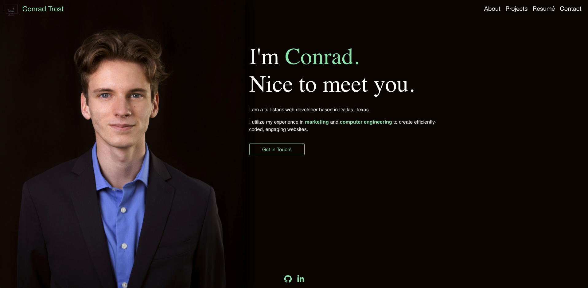

  # Portfolio (React)
  
  ### <a href="https://trost.dev/" target="_blank">trost.dev</a>
  
  ### Developed by [**Conrad Trost**](https://github.com/conradtrost)

  ## Description
  #### A personal portfolio featuring React.

  

  ### Table of Contents:

  **[Description](#description)** 
  **[License](#license)** 
  **[Questions](#questions)** 

  ## License
  This application is covered under the [MIT](https://opensource.org/licenses/MIT) license.
  Visit the link above to learn more about this license.

  ## Questions

  Find me on [Github](https://github.com/retro1967)
  Email me with questions at conrad@trost.dev
