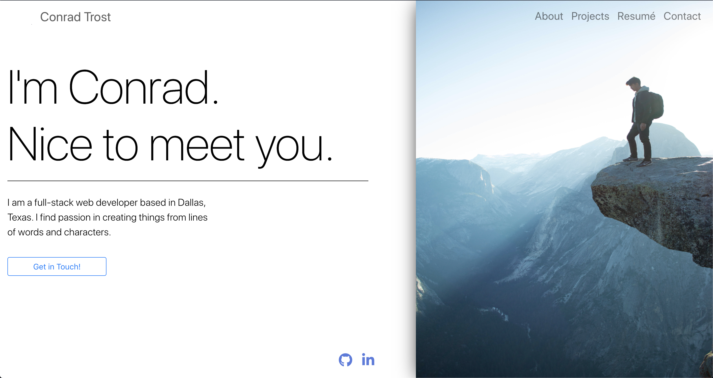

  # Portfolio (React)
  
  ### Developed by [**Conrad Trost**](https://github.com/retro1967)

  ## Description
  #### A personal portfolio featuring React.

  

  ### Table of Contents:

  **[Description](#description)** 
  **[Installation Instructions](#installation-instructions)** 
  **[Usage Instructions](#usage-instructions)** 
  **[Contributions](#contributions)** 
  **[Test Instructions](#test-instructions)** 
  **[License](#license)** 
  **[Questions](#questions)** 

  ## Installation Instructions
  N/A

  ## Usage Instructions 
  N/A

  ## Contributions
  N/A

  ## Test Instructions
  N/A

  ## License
  This application is covered under the [MIT](https://opensource.org/licenses/MIT) license.
  Visit the link above to learn more about this license.

  ## Questions

  Find me on [Github](https://github.com/retro1967)
  Email me with questions at conrad@trost.dev
